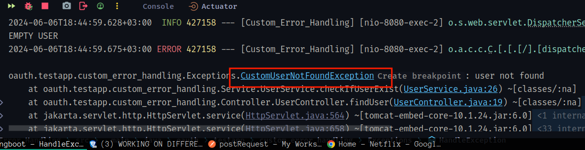

# Custom Exception in Spring Boot
Today lets try to handle exceptions differently , lets create our own exceptions and throw them instead of the in-built exceptions
# Creating A custom Exception Handler
Assuming we want to create an application that checks if users exist in a database then return their information else return an error,by default a ``NoEntryFound `` Exception will be thrown in the console and a 400 status to our client to handle this we are going to use a Global Exception Handler ``@ControllerAdvice`` to handle our exceptions
There are other ways to handle exceptions that we are going to discuss later
### Create app
let create our application using ``Spring.io`` and add the ``web-dependency`` if you know nothing about using Spring initializer I got you covered here [using Initialiser](), The naming of the packages don't matter you can use the ones that suits you.After  
downloading your app ,extracting and making sure that everything works ,gentlemen shall we 😄.

###  Controller
This Time lets follow the SOLID principle and instead of handling the logic inside our controller lets use a ``Service`` package to handle our logic

```java
package oauth.testapp.custom_error_handling.Controller;

import oauth.testapp.custom_error_handling.Exceptions.CustomUserNotFoundException;
import oauth.testapp.custom_error_handling.Service.UserService;
import org.springframework.http.HttpStatus;
import org.springframework.http.ResponseEntity;
import org.springframework.web.bind.annotation.*;

@RestController
@RequestMapping("/users")
public class UserController {
    /* Dependency Injection of the service Class
    * No idea check my SpringBoot Dependency Injection

    * * */
   private  final   UserService userService;
//     Constructor Injection
    public UserController(UserService userService) {
        this.userService = userService;
    }

    /* We can use @PathVariable annotation to access the id of the user from the path
     * then inside the function pass the name of the path we want to access
     * the path should be inside braces e.g get_user/{id} ,
     * NOTE:
     * use the same name inside the function parameter
     */
    @GetMapping("/get_user/{id}")
    public ResponseEntity<?> findUser(@PathVariable String id)  {

        Object user= userService.checkIfUserExist(id);

        return  new ResponseEntity<>(user, HttpStatus.OK);
    }
}

```


Error thrown on the console


